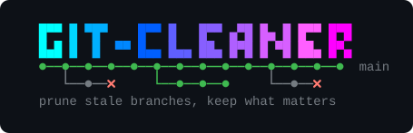
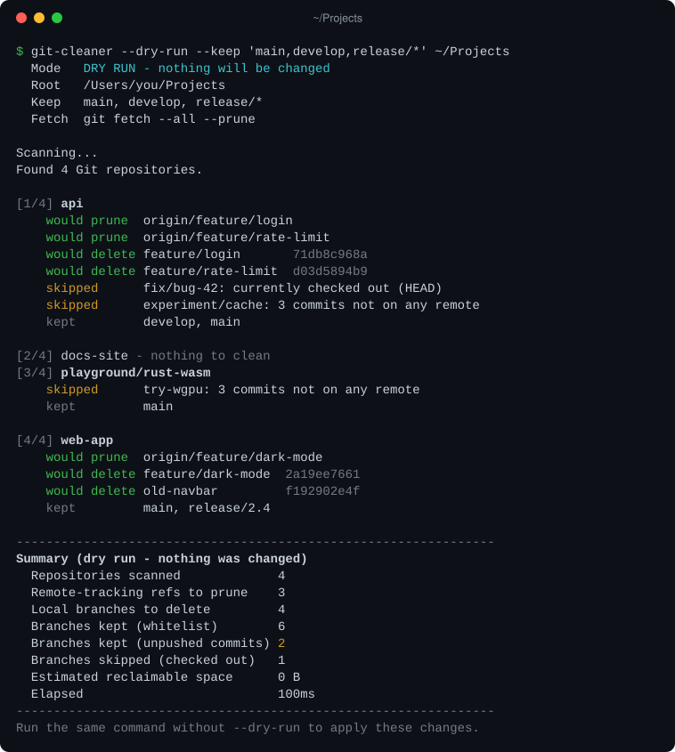

<p align="center">
  
</p>

<p align="center">
  <b>Prune stale Git branches across every repository on your machine, in one command.</b>
</p>

<p align="center">
  <a href="https://github.com/CptConi/git-cleaner/actions/workflows/ci.yml"></a>
  <a href="https://github.com/CptConi/git-cleaner/releases/latest"></a>
  <a href="go.mod"></a>
  
  <a href="LICENSE"></a>
</p>

<p align="center">
  <a href="#install">Install</a> ·
  <a href="#usage">Usage</a> ·
  <a href="#how-it-works">How it works</a> ·
  <a href="#safety">Safety</a> ·
  <a href="#about-disk-space">Disk space</a>
</p>

---

Months of work leave every repository cluttered with local branches: merged
features, abandoned experiments, branches deleted on the remote long ago.
**git-cleaner** walks a folder such as `~/Projects`, finds every Git
repository in it and, in each one:

1. prunes the remote-tracking branches whose branch was deleted on the remote
   (`git fetch --all --prune`);
2. force-deletes (`git branch -D`) every local branch that is not on your keep
   list (`main`, `master`, `dev` and `develop` by default);
3. reports what it did and how much disk space Git can reclaim, and can run
   `git gc` to reclaim it right away.

Nothing is ever pushed: branches on your remotes are never touched.

<p align="center">
  
</p>

## Features

- 🔍 **Finds every repository** under a folder, skipping `node_modules`,
  worktrees and submodules.
- ✂️ **Prunes stale remote-tracking branches**, then deletes local branches,
  merged or not.
- 🛡️ **Keep list** with glob patterns (`release/*`). The checked-out branch and
  branches used by worktrees are never deleted.
- 👀 **`--dry-run`** shows everything that would happen, and flags the
  *unique commits*: work that exists nowhere else.
- 💾 **Disk space report**: an estimate of what Git can reclaim, and the real
  numbers with `--gc`.
- ⚡ **Fast and portable**: repositories are processed in parallel. It is a
  single static binary with no dependency but Git, for macOS, Linux and
  Windows.

## Install

**With Go** (1.22 or later):

```sh
go install github.com/CptConi/git-cleaner@latest
```

The binary lands in `$(go env GOPATH)/bin` (`~/go/bin`, or
`%USERPROFILE%\go\bin` on Windows): make sure that folder is on your `PATH`.

**Prebuilt binaries**: download the archive for your platform from the
[latest release](https://github.com/CptConi/git-cleaner/releases/latest),
extract it and move `git-cleaner` (`git-cleaner.exe` on Windows) to a folder
on your `PATH`. On macOS, a binary downloaded with a browser is quarantined by
Gatekeeper: run `xattr -d com.apple.quarantine git-cleaner` once.

**From source**:

```sh
git clone https://github.com/CptConi/git-cleaner.git
cd git-cleaner
make install        # Windows: go install .
```

Git 2.23 or later must be on the `PATH` (2.31 or later for the disk space
estimate). If you need to set up Git and Go first:

<details>
<summary><b>macOS</b></summary>

```sh
brew install git go
echo 'export PATH="$PATH:$HOME/go/bin"' >> ~/.zshrc   # for go install
```

Apple's Git (`xcode-select --install`) works too.
</details>

<details>
<summary><b>Linux</b></summary>

```sh
sudo apt install git make            # Fedora: sudo dnf install git make
# Distribution packages of Go are often outdated: use the official archive
curl -LO https://go.dev/dl/go1.27.1.linux-amd64.tar.gz   # latest: https://go.dev/dl/
sudo rm -rf /usr/local/go && sudo tar -C /usr/local -xzf go1.27.1.linux-amd64.tar.gz
echo 'export PATH="$PATH:/usr/local/go/bin:$HOME/go/bin"' >> ~/.bashrc
```
</details>

<details>
<summary><b>Windows</b> (PowerShell)</summary>

```powershell
winget install --id Git.Git -e
winget install --id GoLang.Go -e
# open a new terminal so that PATH is refreshed
```

Colors and the banner show up in Windows Terminal, PowerShell and cmd
(Windows 10 or later). Git Bash (mintty) gets plain text.
</details>

## Usage

```text
git-cleaner [options] <root-directory>
```

Always start with a dry run, then apply:

```sh
git-cleaner --dry-run ~/Projects
git-cleaner ~/Projects
```

| Option | Default | Description |
|---|---|---|
| `--keep <list>` | `main,master,dev,develop` | Local branches never deleted: comma-separated names or glob patterns. Replaces the default list. `*` does not match `/`: `release/*` protects `release/1.0`, not `release/1.0/fix`. |
| `--dry-run` | off | Show what would be pruned and deleted; change nothing. |
| `--no-fetch` | off | Skip the fetch/prune step (no network access). |
| `--gc` | off | Run `git gc` in each repository after the cleanup and report the space actually freed ([details](#about-disk-space)). |
| `-j`, `--jobs <n>` | CPUs, max 8 | Repositories processed in parallel. |
| `--timeout <d>` | `2m` | Time limit of each network operation (`30s`, `5m`...); `0` disables it. |
| `--no-color` | off | Plain output. `NO_COLOR` is honored too, and `FORCE_COLOR=1` keeps colors in a pipe (`\| less -R`). |
| `--version`, `-h` | | Print the version / the help. |

Flags go before or after the directory:

```sh
git-cleaner --keep 'main,develop,release/*' ~/Projects   # quote patterns for the shell
git-cleaner --no-fetch --gc ~/Projects                   # offline, then reclaim space
git cleaner --dry-run ~/Projects                         # Git runs git-cleaner as a subcommand
```

| Exit status | Meaning |
|---|---|
| `0` | Success (branches skipped because they are checked out included). |
| `1` | The run completed, but some operations failed (fetch, deletion, gc). |
| `2` | Invalid arguments or unusable environment: nothing was done. |

## How it works

1. **Discovery**: the root folder is walked recursively. A folder containing a
   `.git` *directory* is a repository, and the scan does not descend into it
   (nested clones are usually vendored dependencies or tool caches). A `.git`
   *file* (linked worktree, submodule) is skipped too, because its branches
   belong to the main repository. `node_modules` folders are ignored, symbolic
   links are not followed, and unreadable folders are reported and skipped.
2. **Prune**: `git fetch --all --prune` removes the local remote-tracking
   references (`origin/feature-x`) whose branch no longer exists on the
   server. In dry-run mode, `git remote prune --dry-run <remote>` lists them
   instead: it only asks the remote for its branch list and writes nothing.
   A network or authentication failure is reported, and the cleanup of that
   repository goes on.
3. **Sorting**: each local branch is either *kept* (it matches `--keep`),
   *skipped* (checked out in the working tree or in a linked worktree, which
   Git refuses to delete) or *deleted*. For each branch to delete, the tool
   counts its **unique commits**: commits reachable from no remaining
   reference (remote branch, tag, kept branch, HEAD...), i.e. work that only
   the reflog will still hold. Review them in dry-run mode.
4. **Deletion**: `git branch -D` runs branch by branch. When Git refuses
   (locked reference, branch being rebased...), a warning is printed and the
   next branch is processed.
5. **Report**: the summary gives the counts and estimates the disk space held
   only by the removed references (`git rev-list --disk-usage`).
6. **Optional `git gc`** (`--gc`): one repository at a time, measuring the
   disk usage of `.git` before and after (allocated blocks on macOS and Linux,
   like `du`; file sizes on Windows).

Repositories are processed in parallel, and results are printed in scan order.

## Safety

- Nothing is ever pushed: branches on the remotes are never modified.
- `--dry-run` changes nothing: it only contacts the remotes to list their
  branches. Always run it first: unmerged branches **are** deleted, and
  `unique commits` show which ones hold work that exists nowhere else.
- The checked-out branch and branches used by linked worktrees are never
  deleted. Bare repositories, submodules and worktrees are not processed.
- Git runs non-interactively: `GIT_TERMINAL_PROMPT=0` makes it fail instead of
  waiting for a password, `GCM_INTERACTIVE=never` keeps Git Credential Manager
  from opening sign-in windows (unless you set that variable yourself), and
  `--timeout` bounds network operations (on macOS and Linux, git is first
  asked to stop gracefully so that it removes its lock files). Use an SSH
  agent or stored credentials for private remotes.
- Environment variables such as `GIT_DIR` or `GIT_WORK_TREE`, which would
  send Git to another repository, are removed from the environment of every
  git command.
- Git output is parsed with `LC_ALL=C`, so the language of the system does not
  matter.

## Recovering a deleted branch

The report prints the commit of every deleted branch. To bring one back:

```sh
git -C ~/Projects/api branch experiment/cache c34673700a
```

If the output is lost, `git -C <repository> reflog` lists the commits HEAD
went through. This works as long as Git has not garbage-collected the
objects. Commits you made or checked out stay in the HEAD reflog, and remain
recoverable, for 30 days by default. Other objects can be dropped by the next
garbage collection (automatic, or `--gc`) once they are two weeks old.

## About disk space

A branch is a 41-byte file: deleting it frees nothing by itself. The space is
held by the objects (commits, trees, files) it references, which Git's garbage
collection deletes only when all three conditions hold:

1. **No reference points to them any more.** The estimate therefore leaves out
   objects still reachable from a remote branch, a tag, another branch or
   HEAD: deleting a local branch that still exists on the remote frees nothing.
2. **No reflog entry references them.** By default, entries expire after 30
   days for commits no longer reachable from their branch
   (`gc.reflogExpireUnreachable`), and after 90 days otherwise.
3. **They are older than two weeks** (`gc.pruneExpire`).

Git runs this collection automatically from time to time (`git gc --auto`).
`--gc` runs `git gc` now: it repacks loose objects and deletes the expired
ones, which frees a lot of space in repositories that were never collected. It
keeps the objects that reflogs still reference. On small repositories, `.git`
may even grow slightly (commit-graph, pack indexes).

To reclaim everything immediately in one repository, at the cost of the
recovery safety net (the reflog history of every branch is lost too):

```sh
git -C <repository> reflog expire --expire-unreachable=now --all
git -C <repository> gc --prune=now
```

## Development

```sh
go test ./...      # unit and integration tests (they drive the real git)
make vet           # go vet for every target platform
make build         # ./git-cleaner for this machine
make release       # cross-compile every platform into dist/
```

Continuous integration runs the tests on Linux, macOS and Windows, with the
oldest supported Go version and the latest one. Pushing a `v*` tag (e.g.
`v1.2.0`) makes the [release workflow](.github/workflows/release.yml) build
the binaries with [GoReleaser](https://goreleaser.com) and publish them on the
release page.

| File | Content |
|---|---|
| `main.go` | Command line, orchestration, parallel workers |
| `scan.go` | Repository discovery |
| `cleaner.go` | Per-repository cleanup: prune, sort, delete, estimate, gc |
| `git.go` | Git execution (environment, timeouts, errors) and commands |
| `whitelist.go` | `--keep` parsing and matching |
| `report.go`, `banner.go` | Console output, summary and startup banner |
| `platform_*.go` | OS specifics: terminal colors, disk usage of files |

### Design notes

- **Why Go**: a single static executable per OS and architecture, with nothing
  to install on the target machine (unlike Node.js or Python). Cross-compiling
  every platform from one machine is built in, the standard library covers
  everything (no third-party dependency), startup is instantaneous and
  goroutines make parallel fetches easy. Rust would offer the same deployment
  model at the cost of a steeper learning curve and slower builds, for no gain
  in a tool that mostly waits for git.
- **Why drive the git executable** rather than a Git library such as go-git:
  your own setup (credential helpers, SSH agent and configuration, proxies,
  `safe.directory`, hooks) works exactly as on the command line, with the
  exact behavior of `git fetch --prune` and `git branch -D`.

## Contributing

- `main` holds the released code and only receives merges from `dev`, through
  a pull request.
- `dev` is the integration branch. Each feature lives on its own branch
  (`feature/<name>`), merged into `dev` once validated.
- Commit messages fit on one line: `<type> (<feature>) <what changed>`, e.g.
  `feat (keep-patterns) add glob support, wording for help`.
- The `tests passed` check (the whole CI matrix) is required on `dev` and
  `main`, and pull requests into `main` must come from `dev` (the `source is
  dev` check). The branch rulesets are versioned in
  [`.github/rulesets`](.github/rulesets): *Settings → Rules → Rulesets → New
  ruleset → Import a ruleset*.

## License

[MIT](LICENSE) © 2026 Nicolas Renard
